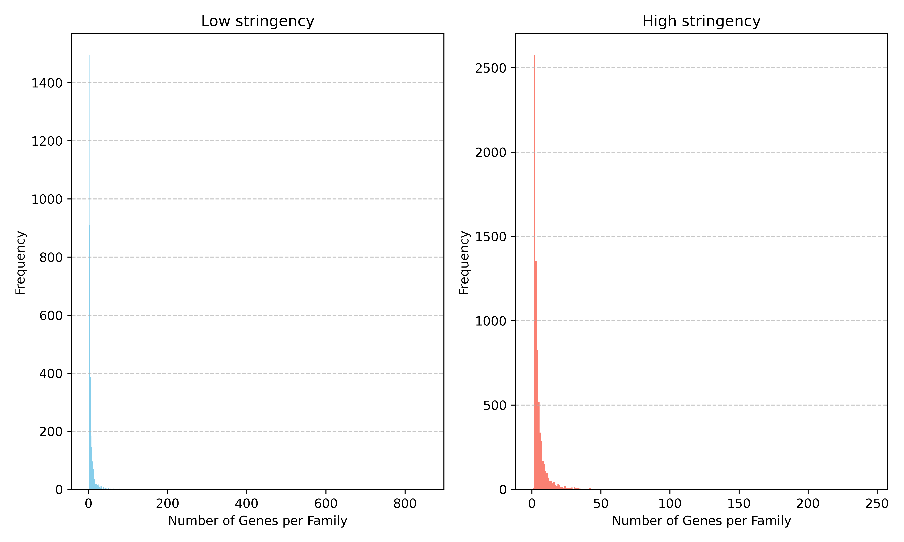
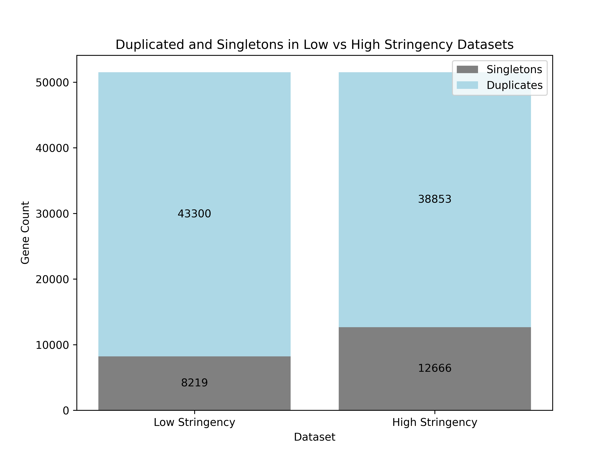
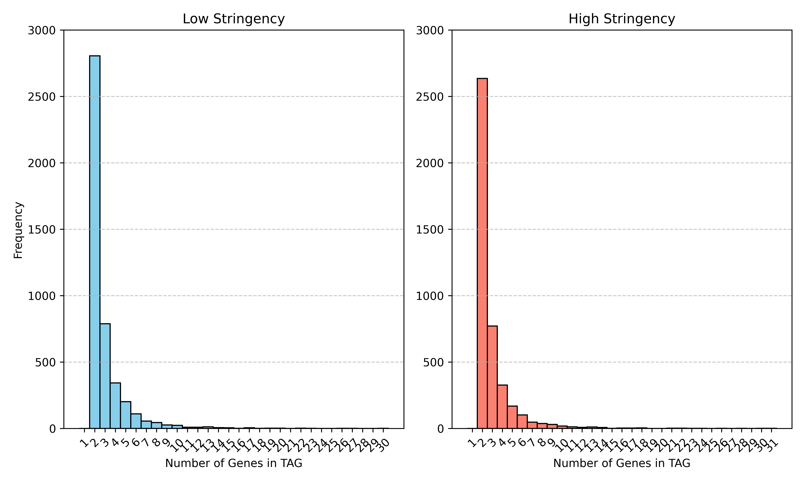
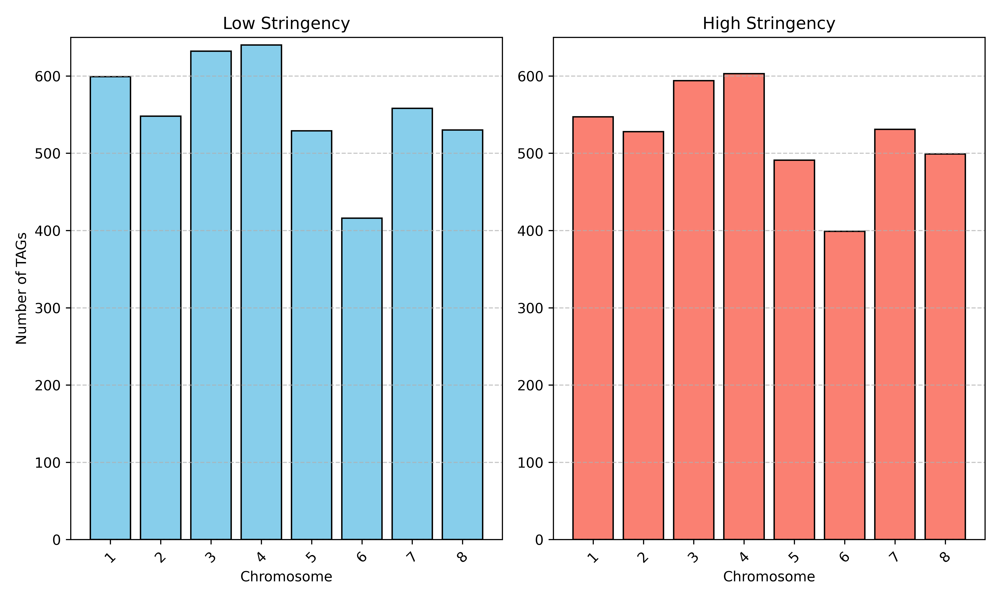
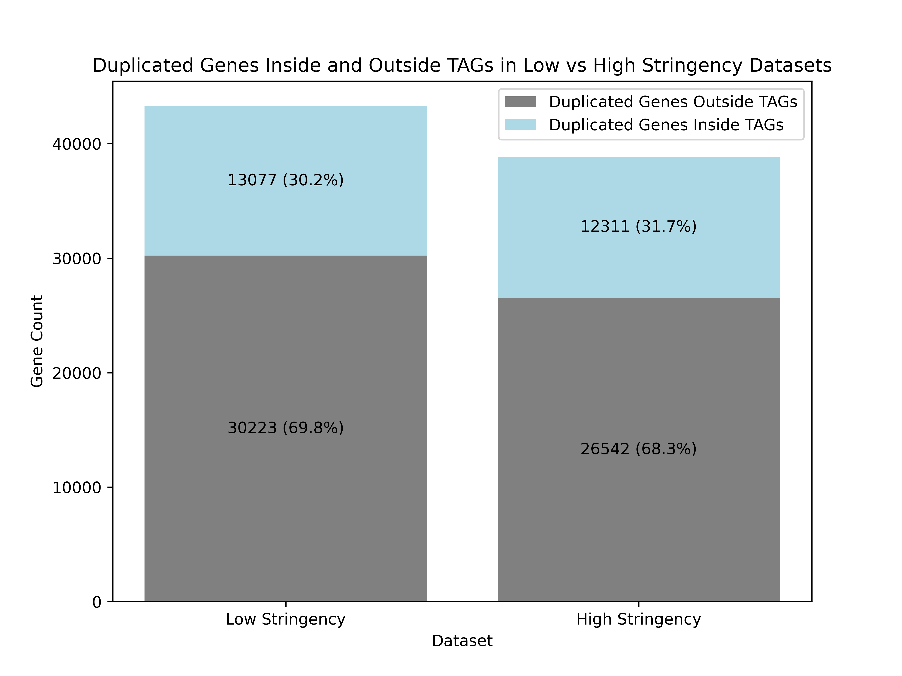
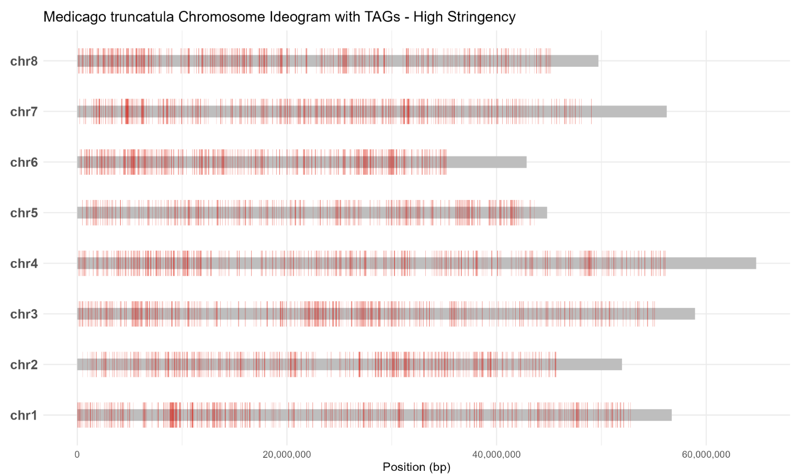
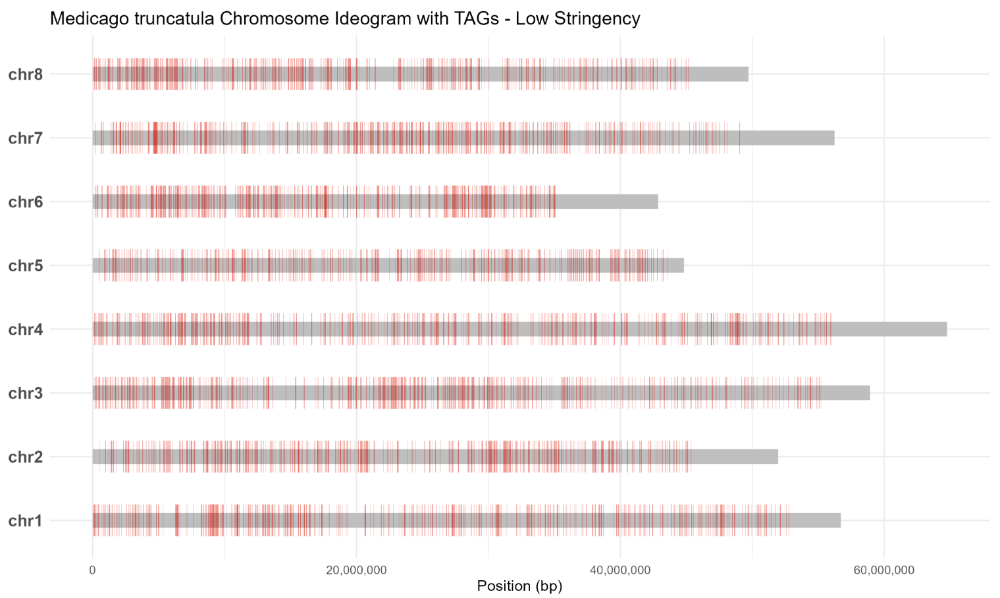
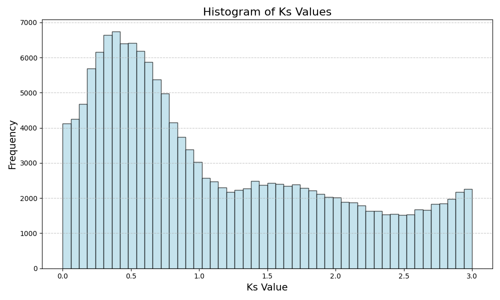
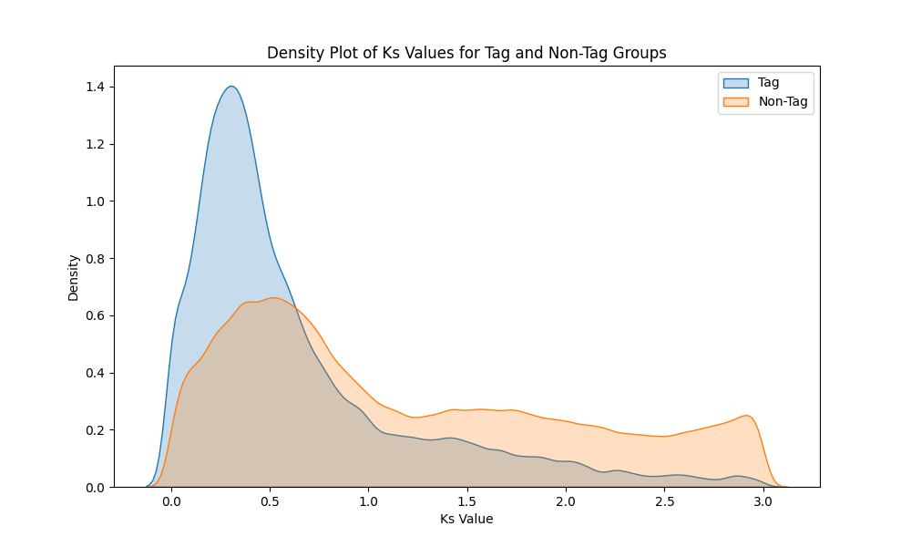
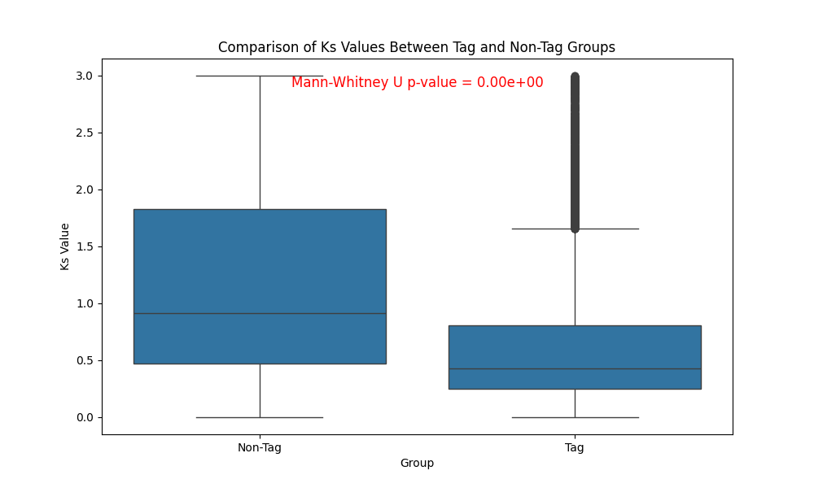

# Comparative genomics project: Detection of duplicated genes in the *Medicago truncatula* genome

## Data
In this project, we analyzed the dupplicate genes in the genomes of the *Medicago truncatula* plant. The *M. truncatula* genome contains eight chromosomes with the genome size of ~384 Mb.
Number of genes: 50894.
Number of isoforms: 57585.

Files provided by the professor:
1. *Medicago_truncatula_Blastp_longIsoforme: Results of BLASTP all-against-all for the longest isoforms of protein sequences.
2. *Medicago_truncatula.MedtrA17_4.0.pep.all.fa: FASTA file containing protein sequences.

Count number of sequences located on chromosomes and scaffolds
```
awk '/^>/ { if (/chromosome:/) chr_count++; else if (/:scaffold/) scaffold_count++; } END { print "Chromosome sequences:", chr_count; print "Scaffold sequences:", scaffold_count; }' Medicago_truncatula.MedtrA17_4.0.pep.all.fa
```
Chromosome sequences: 54929;
Scaffold sequences: 2656.

## Workflow
### I.	Determine the number of duplicat genes in my genome
#### 1. Update Blast result
A Python script (blast_extend.py) enriched the BLAST results with four additional columns: query length, subject length, query coverage, and subject coverage. The enriched results were saved to output_blast.txt.
```
python scipts/blast_extend.py
```
As no mitochondrial or chloroplast sequences were identified in our genome, this step was omitted. To streamline subsequent genome map analysis, we filtered the BLAST results to include only sequences located on chromosomes. Additionally, ten columns were added to the filtered BLAST results, specifying the positions of the sequences on the chromosomes (query start, query end, query chrom, query strand, query geneID, subject start, subject end, subject chrom, subject strand and subject geneID). The updated results were saved to update_blast_results.txt.
```
# Extract Positions, chromosome, strand, and geneID from the FASTA File
awk '/^>/ {if (/chromosome:/) { split($0, a, " "); seq_id = a[1]; seq_id = substr(seq_id, 2); split(a[3], b, ":"); start = b[4]; end = b[5]; chrom = b[3]; strand = b[6]; split(a[4], c, ":"); geneid = c[2]; print seq_id "\t" start "\t" end "\t" chrom "\t" strand "\t" geneid;}}' Medicago_truncatula.MedtrA17_4.0.pep.all.fa > positions.txt

# Filter BLAST results and add information
python scipts/add_position.py
```
We then filter the result based on percentage of identity, query coverage and subject coverage to generate two distinct datasets: one with low stringency and another with high stringency.
```
awk '$3 >= 30 && $17 >= 30 && $18 >= 30' update_blast_results.txt > homolog_low.txt
awk '$3 >= 50 && $17 >= 40 && $18 >= 40' update_blast_results.txt > homolog_high.txt
```
Keep only unique records
```
awk '{ if ($1 < $2) {  key = $1 "\t" $2 } else { key = $2 "\t" $1  } if (!seen[key]++) {  print } }' homolog_low.txt > homolog_low_unique.txt
awk '{ if ($1 < $2) {  key = $1 "\t" $2 } else { key = $2 "\t" $1  } if (!seen[key]++) {  print } }' homolog_high.txt > homolog_high_unique.txt
```

#### 2. Clustering
Extract specific columns from the homolog files and created input files for the MCL clustering method.
```
awk '{print $1, $2, $12}' homolog_low_unique.txt > cluster_input_low.txt
awk '{print $1, $2, $12}' homolog_high_unique.txt > cluster_input_high.txt
```
We ran the clustering with the MCL method for the two datasets. We identified 4938 (43300 genes) and 7006 (38853 genes) families for low and high stringency dataset, respectively, and then visualized the clustering result.
```
python scipts/plot_cluster.py
```
Distribution of number of genes across families

Number of duplicated genes and singletons


#### 3. TAGs 
Extracts gene pairs from the MCL result file and filters BLAST results to retain only matches involving these pairs, then, filter pairs on the same chromosome.
```
python script/extractDup.py
awk -F'\t' '$19 == $24' dup_pairs_low.txt > same_chromosomes_low.txt
awk -F'\t' '$19 == $24' dup_pairs_high.txt > same_chromosomes_high.txt
```
Extract TAGs 
```
python scipts/TAGs_finder.py
```
We identified 4452 (13077 genes) and 4192 (12311 genes) TAGs for low and high stringency dataset, respectively.
What are the biggest TAGs?
```
# For low stringency set
$awk '{split($3, genes, ","); total += length(genes)} END {print "Total genes:", total}' TAGs_low.txt
Total genes: 13077
$awk -F' ' '{print $1, $2, gsub(",", ",", $3)+1}' TAGs_low.txt | sort -k3,3nr | head -n 10
TAG2099 Chromosome:4 30
TAG2996 Chromosome:6 27
TAG118 Chromosome:1 26
TAG4177 Chromosome:8 23
TAG2768 Chromosome:5 22
TAG3010 Chromosome:6 22
TAG3464 Chromosome:7 20
TAG935 Chromosome:2 20
TAG2527 Chromosome:5 19
TAG3992 Chromosome:8 19

#For high stringency set
$ awk '{split($3, genes, ","); total += length(genes)} END {print "Total genes:", total}' TAGs_high.txt
Total genes: 12311
$awk -F' ' '{print $1, $2, gsub(",", ",", $3)+1}' TAGs_high.txt | sort -k3,3nr | head -n 10
TAG2822 Chromosome:6 31
TAG1965 Chromosome:4 30
TAG2816 Chromosome:6 28
TAG3091 Chromosome:6 26
TAG3940 Chromosome:8 24
TAG2595 Chromosome:5 23
TAG131 Chromosome:1 22
TAG3259 Chromosome:7 22
TAG2828 Chromosome:6 21
TAG869 Chromosome:2 21
```
Visualize the results
```
python scipts/plot_TAGs.py
```
Distribution of number of genes in TAGs

Barplot of number of TAGs per Chromosome

Number of duplicated genes inside and outside TAGs

Genomic ideogram with TAGs


Inside the TAGs, are gene oriented significantly the same way?

### II. Estimation of Ks value
We calculated Ks values for the high stringency dataset as it is better. 
First, we retrieved the cds sequences on Ensembl plants stored in Medicago_truncatula.MedtrA17_4.0.cds.all.fa file.
Then we calculated Ks values for all pairs with PAML by running the bash script
```{bash}
bash ./calculateKs.sh
```
From a total of 213887 duplicated pairs, we filtered 155302 pairs with Ks values < 3.
```
awk '$3 >= 3' Ks_calculated.txt > Ks_final.txt
```
Scripts for douwnstream analysis of calculated Ks values:
- *addTAGKs.py*: script for adding a new column to the  *Ks_final.txt* file to distinguish between TAG and non-TAG pairs.
- *Ks_stat.py*: script for statistical test of Ks value distribution and visualization.


Are the TAGs pairs different in age with the other duplicate pairs? 
TAGs: 16987 pairs;
NonTAGs: 138314 pairs.



