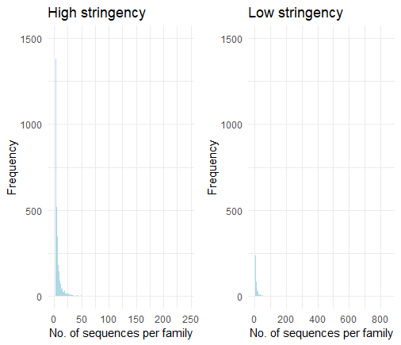
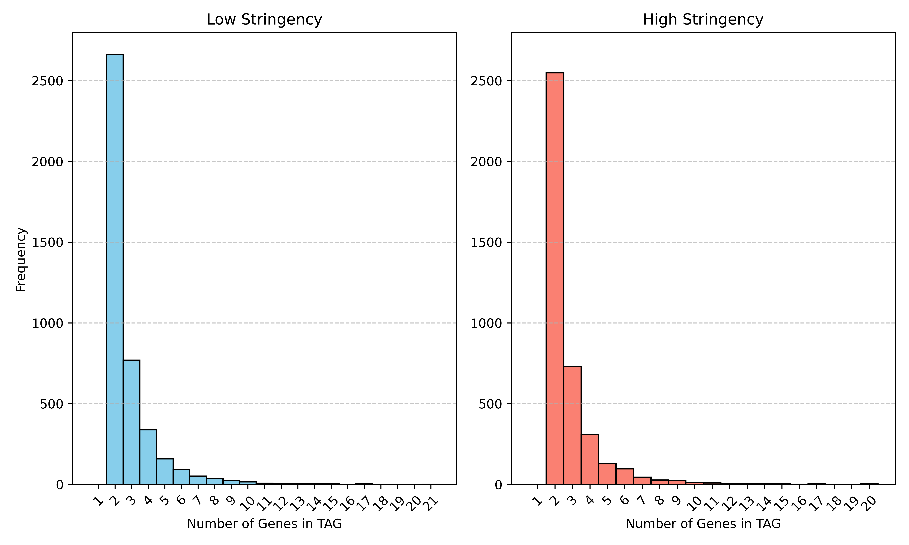
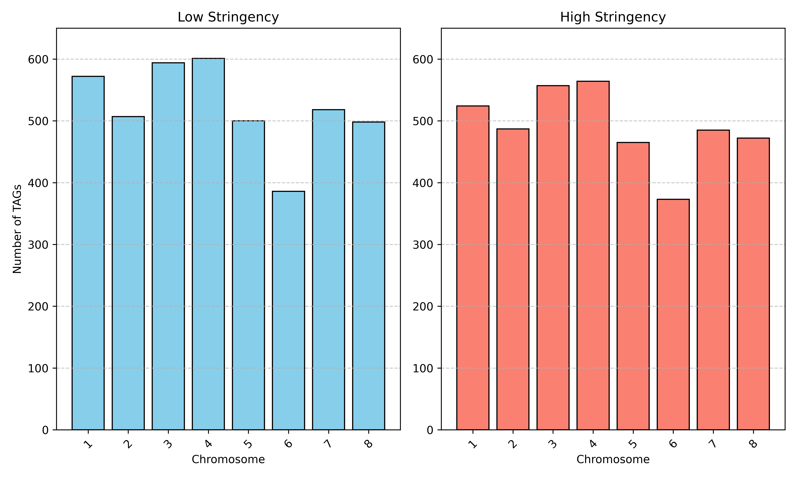

# Medicago_truncatula
 Comparative genomics project

## Data
In this project, we analyzed the dupplicate genes in the genomes of the *Medicago truncatula* plant. The *M. truncatula* genome contains eight chromosomes with the genome size of ?? Mb.
The dataset includes three files...

Count number of sequences located on chromosomes and scaffolds
```
awk '/^>/ { if (/chromosome:/) chr_count++; else if (/:scaffold/) scaffold_count++; } END { print "Chromosome sequences:", chr_count; print "Scaffold sequences:", scaffold_count; }' Medicago_truncatula.MedtrA17_4.0.pep.all.fa
```

## Workflow
### I.	Determine the number of duplicate genes in my genome
#### 1. Update Blast result
A Python script (blast_extend.py) enriched the BLAST results with four additional columns: query length, subject length, query coverage, and subject coverage. The enriched results were saved to output_blast.txt.
```
python3 blast_extend.py
```
As no mitochondrial or chloroplast sequences were identified in our genome, this step was omitted. To streamline subsequent genome map analysis, we filtered the BLAST results to include only sequences located on chromosomes. Additionally, six columns were added to the filtered BLAST results, specifying the positions of the sequences on the chromosomes (query start, query end, query chrom, subject start, subject end, and subject chrom). The updated results were saved to update_blast_results.txt.
```
# Extract Positions from the FASTA File
awk '/^>/ {if (/chromosome:/) { split($0, a, " "); seq_id = a[1]; seq_id = substr(seq_id, 2); split(a[3], b, ":"); start = b[4]; end = b[5]; chrom = b[3]; strand = b[6]; print seq_id "\t" start "\t" end "\t" chrom "\t" strand;}}' Medicago_truncatula.MedtrA17_4.0.pep.all.fa > positions.txt
# Filter BLAST results and add position information
python3 add_position.py
```
We then filter the result based on percentage of identity, query coverage and subject coverage to generate two distinct datasets: one with low stringency and another with high stringency.
```
awk '$3 > 30 && $17 >= 30 && $18 >= 30' update_blast_results.txt > homolog_low.txt
awk '$3 > 50 && $17 >= 40 && $18 >= 40' update_blast_results.txt > homolog_high.txt
```
Keep only unique records
```
awk '{ if ($1 < $2) {  key = $1 "\t" $2 } else { key = $2 "\t" $1  } if (!seen[key]++) {  print } }' homolog_low.txt > homolog_low_unique.txt
awk '{ if ($1 < $2) {  key = $1 "\t" $2 } else { key = $2 "\t" $1  } if (!seen[key]++) {  print } }' homolog_high.txt > homolog_high_unique.txt
```
#### Clustering
Extract specific columns from the homolog files and created input files for the MCL clustering method.
```
awk '{print $1, $2, $12}' homolog_low_unique.txt > cluster_input_low.txt
awk '{print $1, $2, $12}' homolog_high_unique.txt > cluster_input_high.txt
```
We ran the clustering with the MCL method for the two datasets and visualize the clustering result using R.
```{r}
# Import dataset 
MCL_high <- read.table("MCL_high.tabular", header = FALSE, fill = TRUE, sep = "\t", stringsAsFactors = FALSE, na.strings = "")
MCL_low <- read.table("MCL_low.tabular", header = FALSE, fill = TRUE, sep = "\t", stringsAsFactors = FALSE, na.strings = "")

# Count the number of sequences in each family (row)
count_high <- apply(MCL_high, 1, function(row) sum(!is.na(row)))
count_low <- apply(MCL_low, 1, function(row) sum(!is.na(row)))

# Convert sequence counts to a data frame for ggplot
count_high_df <- data.frame(Count = count_high)
count_low_df <- data.frame(Count = count_low)

# Plot histogram using ggplot
hist1 <- ggplot(count_high_df, aes(x = Count)) +
  geom_histogram(binwidth = 1, fill = "lightblue") +
  labs(
    title = "High stringency",
    x = "No. of sequences per family",
    y = "Frequency"
  ) +
  ylim(0, 1500) + 
  theme_minimal()
hist2 <- ggplot(count_low_df, aes(x = Count)) +
  geom_histogram(binwidth = 1, fill = "lightblue") +
  labs(
    title = "Low stringency",
    x = "No. of sequences per family",
    y = "Frequency"
  ) +
  ylim(0, 1500) + 
  theme_minimal()

grid.arrange(hist1, hist2, ncol = 2)
```


#### TAGs
Extract homologous pairs on the same chromosome and same strand.
```
awk -F'\t' '$19 == $23' homolog_low_unique.txt > same_chromosomes_low.txt
awk -F'\t' '$19 == $23' homolog_high_unique.txt > same_chromosomes_high.txt
awk -F'\t' '$20 == $24' same_chromosomes_low.txt > final_low.txt
awk -F'\t' '$20 == $24' same_chromosomes_high.txt > final_high.txt
```
Extract TAGs 
```
python TAGs_finder.py
```
Visualize the results

